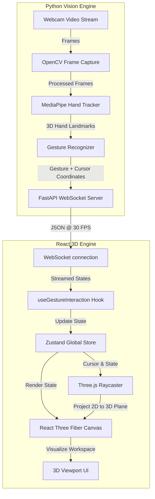

# Gesture-Controlled 3D CAD Application

An intuitive, contactless, and web-based 3D Computer-Aided Design (CAD) modeling workspace. By leveraging standard webcams and computer vision, this project enables users to interact with and create 3D geometry in virtual space using natural hand gestures, eliminating the dependency on traditional 2D mouse and keyboard inputs.

---

## 📌 Project Overview

Traditional CAD software relies heavily on keyboards, mouse clicks, and keyboard shortcuts to navigate 3D environments, leading to a steep learning curve and unintuitive spatial mapping. 

This application provides a **hardware-free, gesture-driven 3D canvas** using a standard webcam. It tracks the user's hand landmarks in real-time, recognizes specific gestures, and projects those hand movements onto a virtual 3D working plane using a raycasting engine in a browser.

### 🌟 Key Features

*   **Real-Time Hand Tracking**: Uses a webcam to track hand movements with high precision and low latency.
*   **Intuitive Gesture Controls**:
    *   `OPEN_PALM`: Swipe and rotate the 3D drawing plane in virtual space.
    *   `FIST`: Lock/unlock the active drawing plane to stabilize drawing.
    *   `PINCH`: Draw 3D lines in real-time (acts as a virtual pen down).
*   **Fast WebSocket Communication**: Real-time streaming of hand coordinates and gesture states at 30 FPS.
*   **Web-Based 3D Engine**: Uses Three.js and React Three Fiber to render the virtual workspace, working grid, custom cursor states, and generated 3D lines.

---

## 🏗️ System Architecture

The application is built on a decoupled, real-time client-server architecture:



---

## 🛠️ Tech Stack

### Backend (Vision Engine)
*   **Python 3.10+**: Core programming language.
*   **FastAPI**: High-performance web framework for APIs and WebSockets.
*   **Google MediaPipe**: Hand tracking and landmark estimation solution.
*   **OpenCV (opencv-python)**: Video capture, image transformations, and frame processing.
*   **Uvicorn**: ASGI web server implementation.

### Frontend (3D Engine)
*   **React & Vite**: Frontend UI framework and fast build tool.
*   **Three.js**: Lightweight 3D library for WebGL rendering.
*   **React Three Fiber (R3F)**: Declarative Three.js wrapper for React.
*   **Zustand**: Fast and scaleable barebones state manager.

---

## 🎮 Gesture Interaction Guide

| Gesture | Visual | Action in Workspace |
| :--- | :---: | :--- |
| **Open Palm** | 🖐️ | Swiping left, right, up, or down rotates the 3D working plane. |
| **Fist** | ✊ | Locks the 3D working plane in place to prevent accidental rotation. |
| **Pinch** (Thumb + Index) | 👌 | Activates "pen down" mode to draw continuous 3D lines on the active plane. |
| **Idle** | - | Moves the virtual 3D cursor around without drawing or rotating. |

---

## 🚀 Getting Started & Local Setup

Ensure you have Git, Python 3.10+, and Node.js installed.

### 1. Clone the Repository
```bash
git clone https://github.com/AlishLaimayum/3D-CAD-modelling-using-hand-gesture.git
cd 3D-CAD-modelling-using-hand-gesture
```

### 2. Backend Setup
1. Navigate to the backend folder:
   ```bash
   cd backend
   ```
2. Create and activate a virtual environment:
   ```bash
   python -m venv venv
   # On Windows (PowerShell):
   .\venv\Scripts\Activate.ps1
   # On Linux/macOS:
   source venv/bin/activate
   ```
3. Install dependencies:
   ```bash
   pip install -r requirements.txt
   ```
4. Start the FastAPI server:
   ```bash
   python main.py
   ```
   The backend server will run on `http://localhost:8000` with the WebSocket endpoint open at `ws://localhost:8000/ws/tracking`.

### 3. Frontend Setup
1. Open a new terminal and navigate to the frontend folder:
   ```bash
   cd frontend
   ```
2. Install the node packages:
   ```bash
   npm install
   ```
3. Run the development server:
   ```bash
   npm run dev
   ```
4. Open your browser and navigate to the local URL (usually `http://localhost:5173`). Allow the browser to access your webcam, position your hand in the camera view, and start modeling!

---

## 📂 Project Structure

```text
3D-CAD-modelling-using-hand-gesture/
├── backend/
│   ├── tracking/
│   │   ├── __init__.py
│   │   ├── hand_tracker.py       # Extract 3D landmarks from hand
│   │   └── gesture_recognizer.py   # Recognize gestures (Pinch, Fist, Palm)
│   ├── main.py                   # FastAPI server, OpenCV loop, and WebSockets
│   └── requirements.txt          # Python dependencies
├── frontend/
│   ├── src/
│   │   ├── cad/                  # CAD logic and Plane management
│   │   ├── components/           # UI overlay, canvas components, Viewport
│   │   ├── hooks/                # WebSocket hooks, gesture event loops
│   │   ├── store/                # Zustand global state store
│   │   ├── App.jsx
│   │   └── main.jsx
│   ├── package.json              # Frontend packages
│   └── vite.config.js            # Vite configuration
├── project_explanation.md         # Detailed overview of implementation
├── project_proposal.md            # Initial academic project proposal
└── project_report.md              # Project report document
```

---

## 🔮 Future Roadmap (Spring Boot Cloud Integration)

Currently, the application runs as a real-time local drawing tool. Future work involves transforming it into a full-scale cloud CAD platform:

1. **Spring Boot Backend**: Introduce a robust, enterprise-grade Java Spring Boot API layer to handle:
   * **User Authentication**: Secure logins with Spring Security and JWT.
   * **Model Persistence**: Creating REST endpoints to save user-drawn 3D geometries and shapes.
2. **Database Storage**: Integrating a database (PostgreSQL/MySQL) to persist project files and CAD history.
3. **Decoupled Architecture**: 
   * React UI interacts with the Python server for low-latency webcam processing and canvas coordinates.
   * React UI interacts with the Spring Boot server for account management and saving/loading project files.
